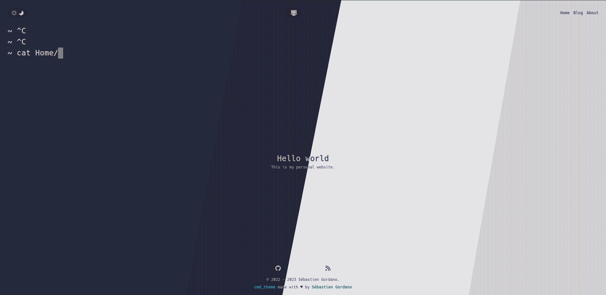
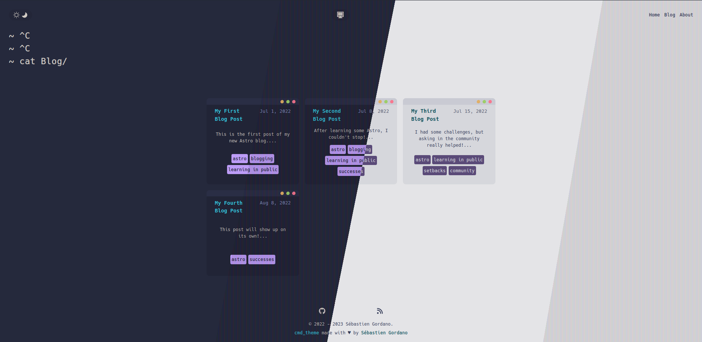
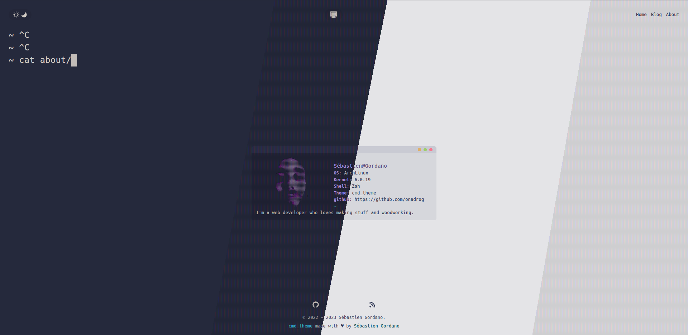

# Cmd Theme

A theme for astro.





[Live Preview](https://onadrog.github.io/)

## Feat

-   Use Sass
-   Blog post pagination
-   Semantic / A11y ready

## Usage

### requirements

-   [Pnpm](https://pnpm.io/https://pnpm.io/)

```bash
$ mv .env.example .env # set your site URL and base
$ pnpm install # install dependencies
$ pnpm run dev # run the dev env
$ pnpm run build # check astro and ts files and build your site
$ pnpm run build:prev # build the site without check and run the preview command
```

## Site data

You must set the variables in the .env file ( rename .env.example to .env if
you haven't already do that)
You can modify default values in data/site.ts file.

## Astroadd cli

You can use [Astroadd-cli](https://github.com/onadrog/astroadd-cli) to create markdown files with auto generate frontmatter.

## A11y / Semantics Resources

[style guide](https://a11y-style-guide.com/style-guide/)

[W3C](https://www.w3.org/WAI/tutorials/)

## License [Mit](LICENSE)
